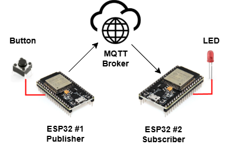
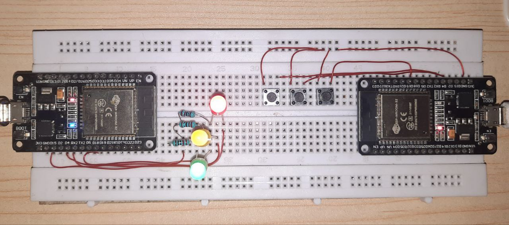
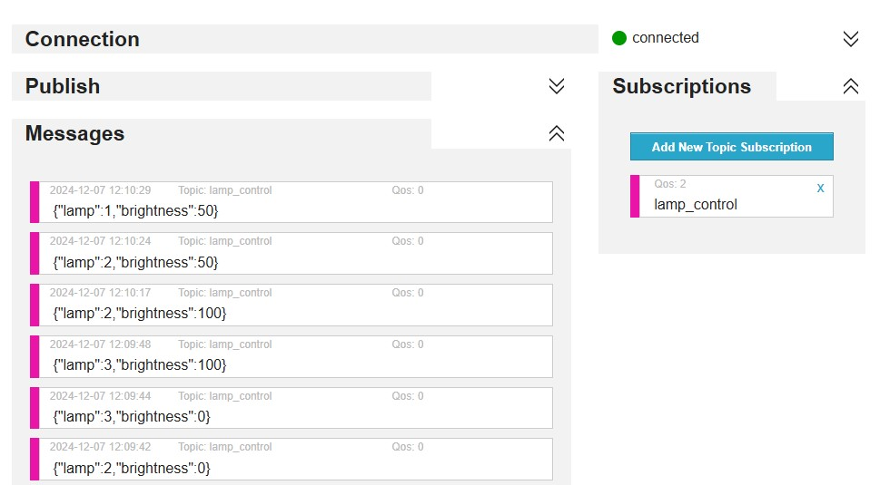

# Lighting Control Using ESP32 with MQTT Protocol and JSON

This project implements an IoT-based lighting control system using ESP32 microcontrollers, enabling remote management of individual lights, each controlled by a dedicated push button. Each light supports three states: 
- 50% brightness
- 100% brightness
- off

Communication between two ESP32 devices is facilitated using the MQTT protocol, ensuring efficient and reliable data transfer.

**Features**
- Dynamic Brightness Control: Adjust light brightness (50%, 100%, or off) with a single button press.
- Scalable and Modular Design: The system can be extended to control additional lights or devices.
- Efficient Communication: Uses MQTT for fast, reliable, and lightweight data transmission.
- JSON Message Format: Ensures structured and easily parseable data exchange.
- User-Friendly Interface: Physical push buttons for input, with visual feedback through lights.

**System Architecture**





The system architecture involves:
- ESP32 Publisher: Reads button states and sends corresponding messages to the MQTT broker.
- MQTT Broker: Handles message delivery between publisher and subscriber.
- ESP32 Subscriber: Controls the brightness of lights based on received messages.

**Installation and Setup**

**1. Prerequisites**

Hardware:
- 2 x ESP32 boards
- 3 x Push Buttons
- 3 x LEDs or Light Bulbs (PWM-compatible for brightness control)
- Resistors (as needed for LED and button connections)
- Laptop
- Breadboard and Jumper Wires
  
Software:
- Arduino IDE with ESP32 board support
- MQTT Broker (HiveMQ)
- MQTT Client Library (PubSubClient)
JSON library for Arduino (ArduinoJson)

**2. Setting Up the ESP32**
- Install the ESP32 board in Arduino IDE if not already installed.
- Open Arduino IDE, select **Tools > Board > ESP32 Dev Module**.
- Ensure the PubSubClient library and ArduinoJson library (for handling JSON data) are installed.
  
**3. Configuring HiveMQ Broker**
- Use HiveMQ Cloud or set up your own HiveMQ broker.
- If using HiveMQ Cloud, create an account and get the MQTT broker URL and credentials.
- Ensure the ESP32 devices can connect to HiveMQ via WiFi.
  
**4. Uploading Code to the ESP32**
- Download or clone the repository and open the project in Arduino IDE.
- Update the WiFi credentials and HiveMQ broker settings in the code.
- Select **Tools > Port** to choose the correct ESP32 port, and upload the code.
  
**5. Setting Up the Control Interface**
- Use an MQTT client (e.g., MQTT Dashboard) to send MQTT commands with JSON payloads.
- Make sure to publish messages to the correct MQTT topics to control the lights.
  
**How to Control the Lights**
1. Button Press: Press the button on ESP32 (Publisher) to send an MQTT message to ESP32 (Subscriber), controlling the LED's brightness or turning it off.
2. JSON Message Format: The message sent to lamp_control topic will be in JSON format:
```{"lamp":1,"brightness":50}```

**Result**




